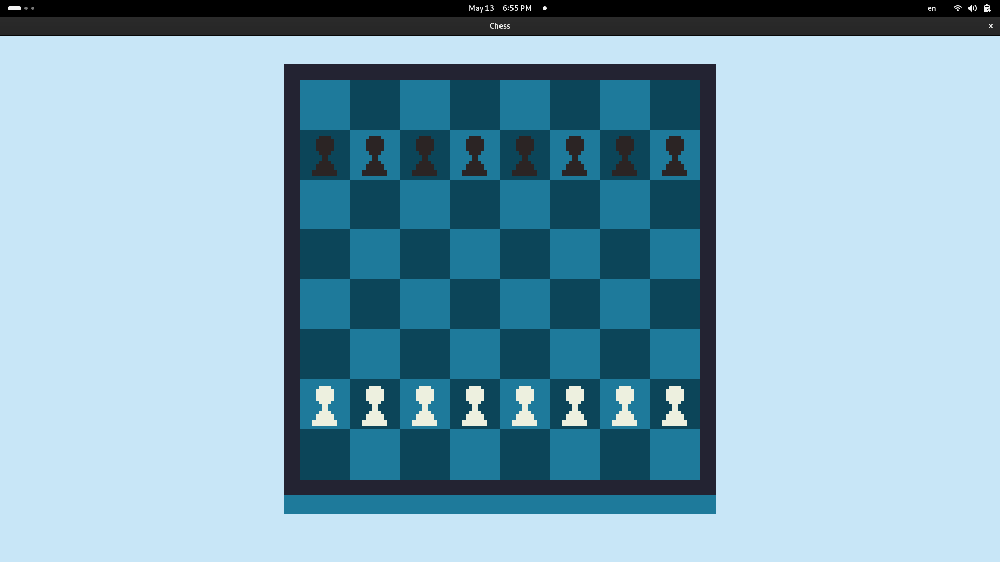
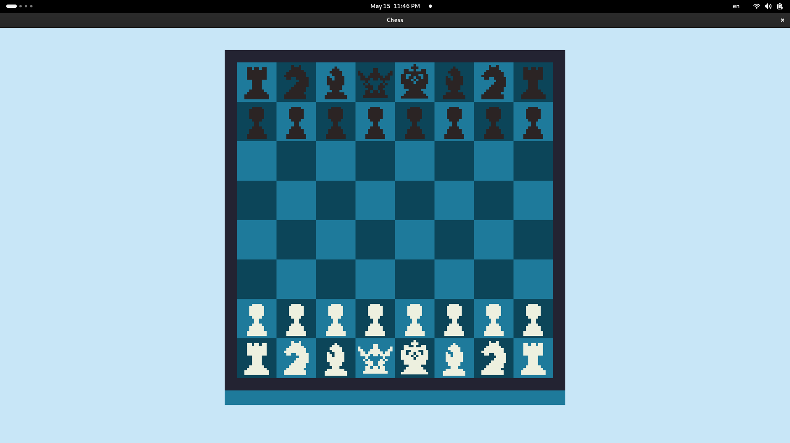

<h1>Chess clone</h1>

<h3> Launch</h3>

```bash

g++ game/main.cpp game/board/Board.cpp game/figures/King/King.cpp game/figures/Queen/Queen.cpp game/figures/Knight/Knight.cpp game/figures/Bishop/Bishop.cpp game/figures/Rook/Rook.cpp game/figures/Pawn/Pawn.cpp game/figures/Figure.cpp game/Hint/Hint.cpp game/Game.cpp -Igame -Igame/core -Igame/figures -Igame/figures/Pawn -Igame/figures/Bishop -Igame/figures/King -Igame/figures/Knight -Igame/figures/Queen -Igame/figures/Rook -Igame/board -Igame/Hint -o chess-app -lsfml-graphics -lsfml-window -lsfml-system

./chess-app

```

---

<h2>General to_do_list:</h2>

- [x] get_possible_moves for each figure
- [x] split method Game::run() into some another methods
- [x] add state pattern 
- [] makefile

---
<h2>Diary to_do_list:</h2> 

## Thursday - 01.05.25
- [x]  make assets
- [x]  draw base board
- [x] started making class "Board" for drawing chess board by cells


## Friday - 02.05.25
- [x] finish class Board
- [x] start making new class "Figures"


## Thursday - 08.05.25

- [x] class "Figure"
- [x] class "Pawn"


## Friday - 09.05.25

- [] finish class "Pawn"
- [x] try to start class "Game"

## Monday - 12.05.25

- [x] finish class "Pawn"
- [x] try to start class "Game"

## Tuesday - 13.05.25
- [x] finish class "Pawn" for print
- [x] correct class "Figure"
- [x] print Pawns



## Thursday - 15.05.25
- [] make makefile
- [x] do interact with figures
- [x] display another figures



## Tuesday - 20.05.25
- [x] bug fixing Game::run()
- [x] method is_current_move for Pawns
- [x] method get_possible_moves for Pawns

## Tuesday - 27.05.25
- [x] fix class board
- [x] method Game::run() optimization
- [x] move pawns correctly

## Wednesday - 28.05.25 General refactoring
- [] State pattern  
- [] refactoring class Game 
- [x] refactoring class Board

## Thursday - 29.05.25 General refactoring done
- [x] State pattern  
- [x] refactoring class Game 

Added enum class Action, which used for different game conditions. Refactored class Game(splited method Game::run() into some new methods)
code became more readable


## Saturday - 31.05.25

- [x] finish find_moves() for Pawn
- [] makefile
- [x] get_possible_moves for each figure
- [] fix hint render


## Tuesday - 04.06.25
- [x] check/mate/draw logic
- [] last cell for Pawns
- [x] castling
- [x] fix hints rendering
- [] makefile  


## Sunday - 08.06.25
- [x] last cell for Pawns
- [] makefile  
- [] zvit

---

