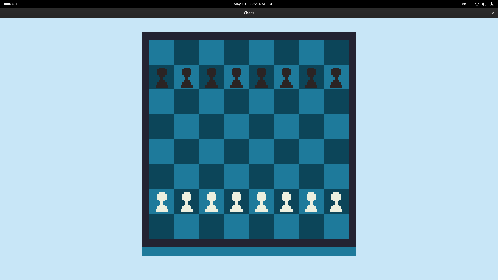

<h1>Pixel Chess</h1>

<h3> Launch</h3>

```bash

g++ main.cpp board.cpp path_size.cpp -o chess-app -lsfml-graphics -lsfml-window -lsfml-system
./chess-app

```

---
<h2>Total to_do_list:</h2>


- [] finish figure classes  
- [x] create new class Game
- [] move class Board to class Game

---
<h2>Diary to_do_list:</h2> 

## Thursday - 01.05.25
- [x]  make assets
- [x]  draw base board
- [x] started making class "Board" for drawing chess board by cells


## Friday - 02.05.25
- [x] finish class Board
- [x] start making new class "Figures"


## Thursday - 08.05.25

- [x] class "Figure"
- [x] class "Pawn"


## Friday - 09.05.25

- [] finish class "Pawn"
- [x] try to start class "Game"

## Monday - 12.05.25

- [x] finish class "Pawn"
- [x] try to start class "Game"

## Tuesday - 13.05.25
- [x] finish class "Pawn" for print
- [x] correct class "Figure"
- [x] print Pawns



## Thursday - 14.05.25
- [] make makefile
- [] do interact with figures
- [] display another figures

---

